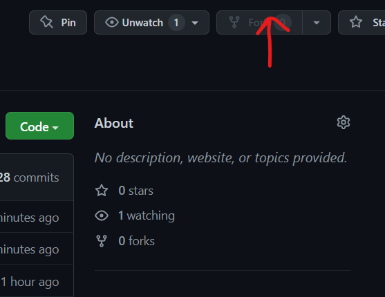
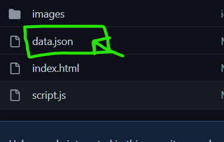
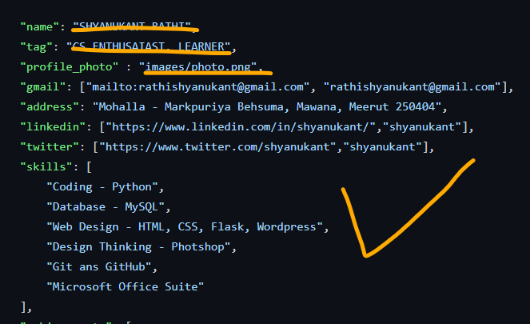
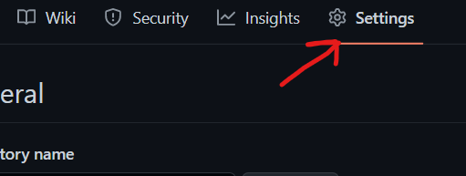
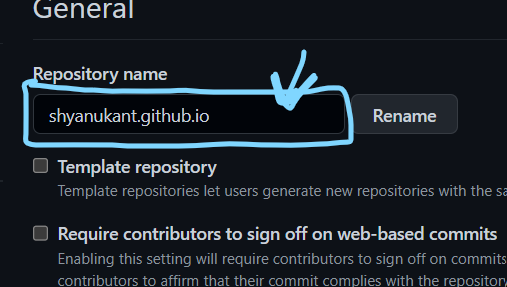

# Shyanukant Rathi - Online Resume

<h1>Hey </h1>
If you want an online "Resume" you can try it with just a few simple steps below:

## Step 1:

Fork this repository by clicking on the fork button on the top of this page. This will create a copy of this repository in your account.

## Step 2:
Go to your GitHub account, open the forked repository, Now open the JSON file then make changes like adding your name, experience, education, projects, etc. Now commit those changes. 
 

## Step 3:
Go to setting, then change your repository name and make sure "github.io" must be there. 
 

### WOW🤩, You did.

